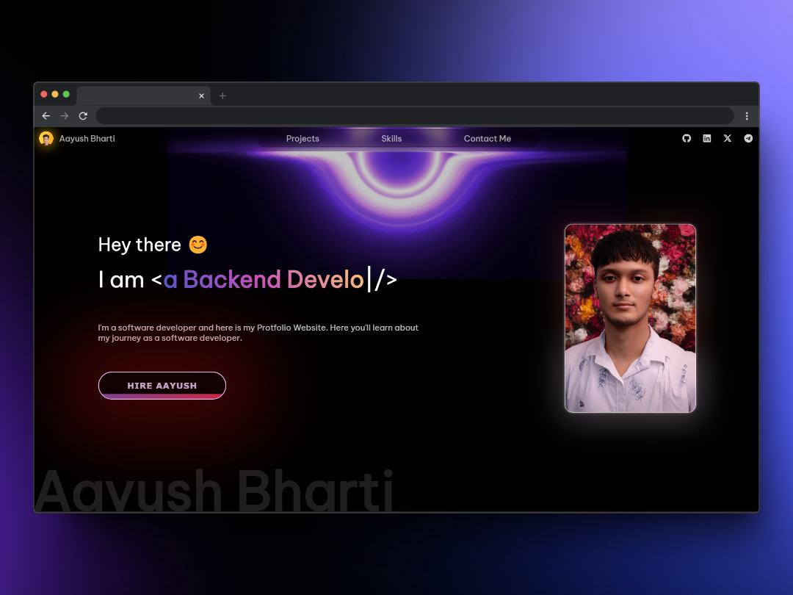

# Devfolio - Portfolio Template ⚡️

## A Professional, Sleek Portfolio for Developers!

---

## 🌐 LIVE DEMO

**[View the Portfolio](https://free-portfolio-aayush.vercel.app/)**

---

## ⭐ Give This Repo a Star

If you find this project useful or interesting, please consider giving it a star on GitHub! Your support helps me keep this project updated and motivates me to work on more cool stuff.

---

## 📸 Portfolio Preview

---

## 🚀 Features

- **Modern UI Design + Reveal Animations:** Eye-catching animations and a sleek, modern look.
- **Single Page Layout:** Easy-to-navigate one-page design, offering simplicity and elegance.
- **CSS Powered Styling:** Styled with the latest CSS techniques for vibrant design.
- **Fully Responsive:** Optimized for devices of all sizes, from desktops to smartphones.
- **HTML5 & CSS3 Compliance:** Adheres to web standards for a future-proof, robust portfolio.
- **Blazing Fast Performance:** Optimized to ensure a smooth, seamless experience for all users.
- **Detailed Documentation:** Step-by-step instructions for setup, customization, and further development.

Check out the demo: **[Click here](https://free-portfolio-aayush.vercel.app/)**

---

## Why Do You Need a Portfolio? ☝️

- **Showcase Your Expertise:** Present your projects, skills, and achievements in a polished and professional way.
- **Increase Your Online Presence:** Boost your digital visibility to potential clients and employers.
- **Go Beyond a Resume:** Demonstrate your abilities and creativity through a live, interactive showcase.

---

## 📫 Get in Touch

For any inquiries or feedback, feel free to reach out:

- **Email**: [iAayushBharti@gmail.com](mailto:iAayushBharti@gmail.com)
- **LinkedIn**: [Aayush Bharti on LinkedIn](https://www.linkedin.com/in/iaayushbharti/)

---

Thank you for checking out the Devfolio template!
